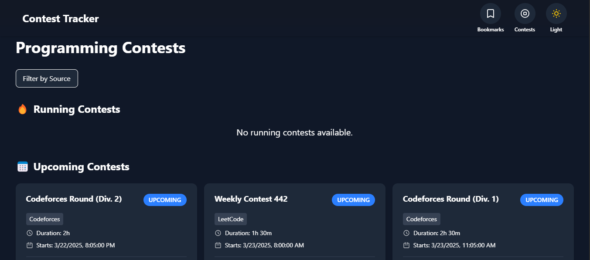
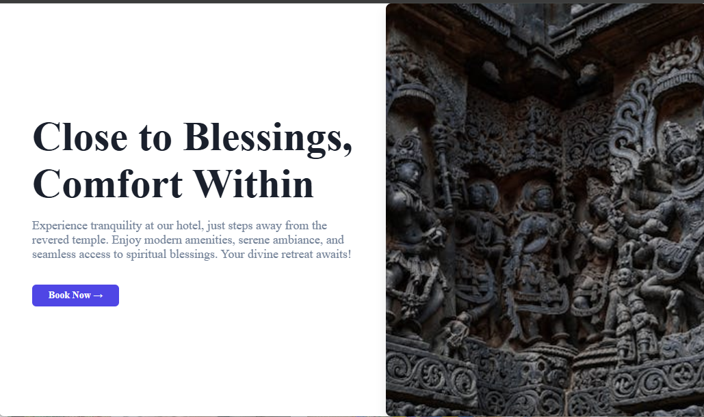
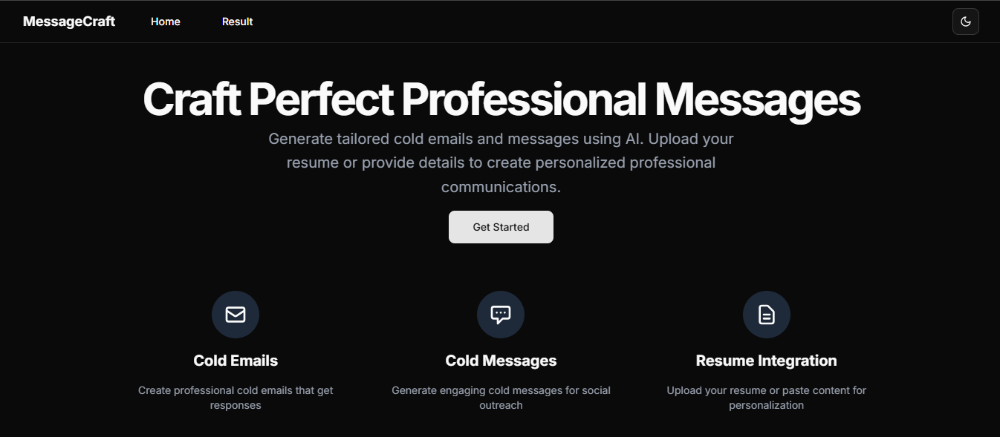

# Portfolio Project

## Description
This portfolio project showcases various web applications developed using modern web technologies. It serves as a personal portfolio to demonstrate skills and projects.

## Features
- Interactive UI with smooth animations.
- Responsive design for various screen sizes.
- Displays a collection of projects with descriptions and links.

## Projects Overview
### 1. ContestWeb Site
- **Description**: A website where you can find all the information about the contest that is running, upcoming, and past contests from different platforms like Codeforces, CodeChef, and LeetCode.
- **Skills**: Next.js, TypeScript, Redux Toolkit, TailwindCSS
- **GitHub**: [ContestWeb GitHub](https://github.com/ABhavikj123/contestweb.git)
- **Demo**: [ContestWeb Demo](https://contestweb.vercel.app)
- 

### 2. Hotel Booking Website
- **Description**: A website where you can book hotel rooms and see the details of the hotel.
- **Skills**: TypeScript, MERN stack, PostgreSQL, TailwindCSS, MUI
- **GitHub**: [Hotel Booking GitHub](https://github.com/ABhavikj123/hotel.git)
- 

### 3. News Website
- **Description**: A news website that fetches news from different sources and allows users to search for news articles.
- **Skills**: React.js, Vite, Bootstrap, NewsAPI
- **GitHub**: [News Website GitHub](https://github.com/ABhavikj123/NEWSWEB.git)
- 

## Technologies Used
- React
- TypeScript
- Vite
- TailwindCSS
- Framer Motion

## Installation Instructions
1. Clone the repository:
   ```bash
   git clone https://github.com/ABhavikj123/portfolio.git
   ```
2. Navigate to the project directory:
   ```bash
   cd portfolio
   ```
3. Install dependencies:
   ```bash
   npm install
   ```

## Usage
To start the development server, run:
```bash
npm run dev
```
Open your browser and navigate to `http://localhost:3000` to view the application.

## License
This project is licensed under the MIT License.
